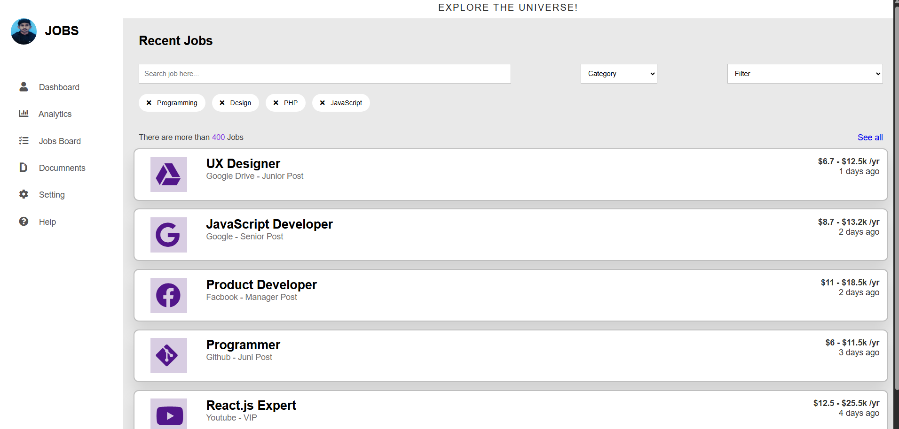

# 💼 Job Dashboard

A simple and responsive job board webpage built using **HTML** and **CSS**, 
Designed to display job listings with titles, companies, locations, and action buttons in a clean card layout.

---

## 📷 Preview

---

## 📌 Features

- 📄 Clean layout with job cards
- 🎯 Easy-to-read job information: title, location, company
- 📱 Responsive design (mobile-friendly)
- 🧩 Modular and well-commented code

---

## 🛠️ Tech Stack

- **HTML5**
- **CSS3**

---

## 🚧 Future Improvements

- Add job filtering by location or role
- Connect to a live API for real-time job data
- Improve responsive layout with grid or Flexbox

---

## 📢 Author

Made with ❤️ by [Madhav Agrawal](https://github.com/MadhavAgrawal06)

